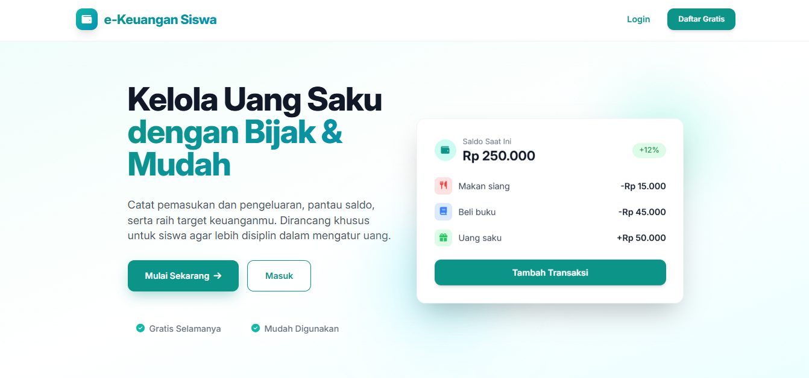
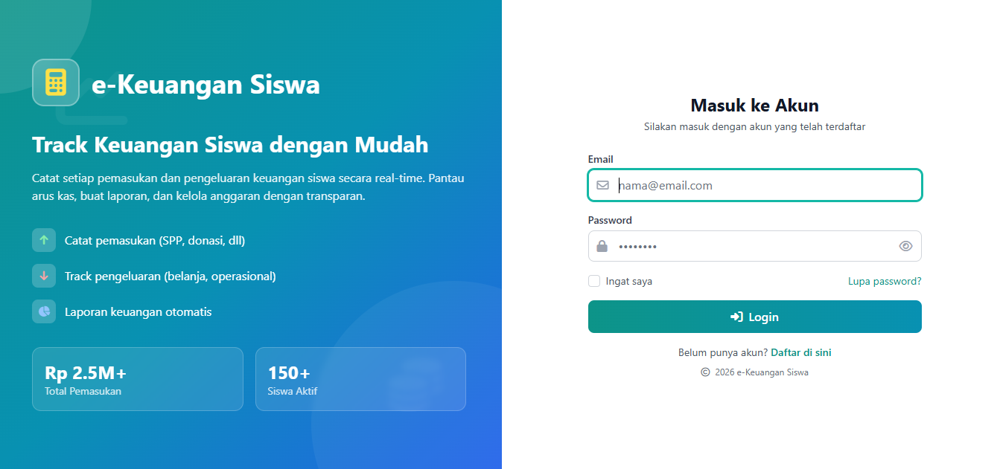
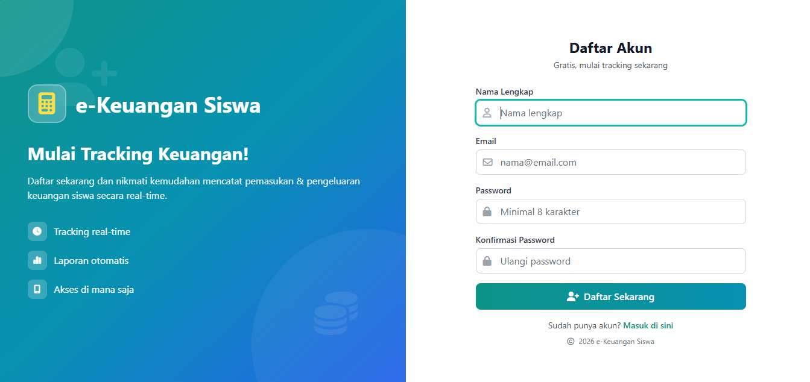
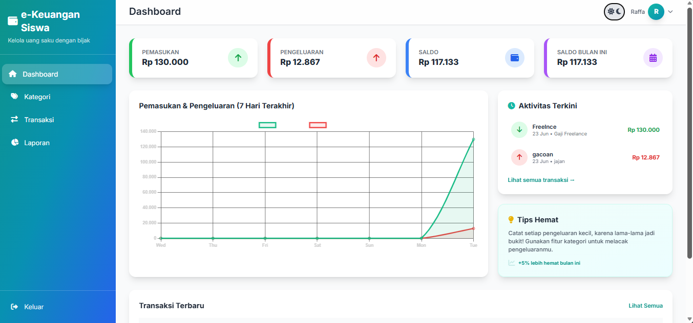
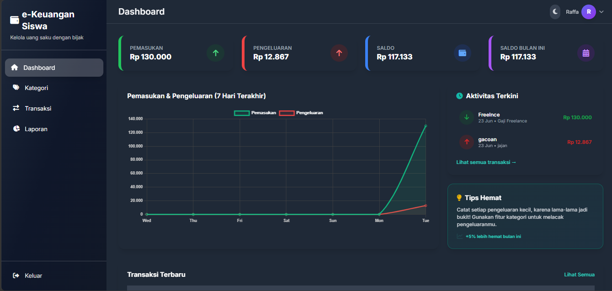
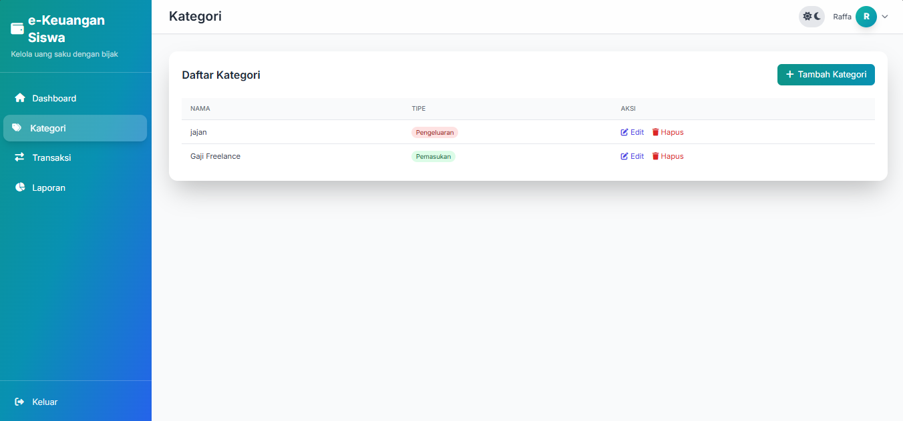
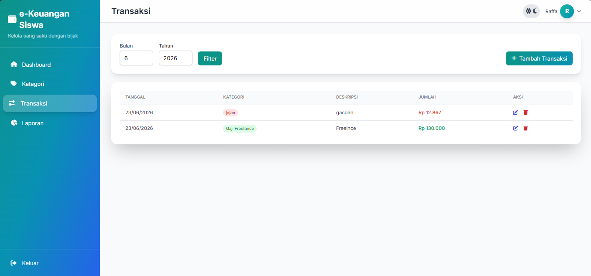
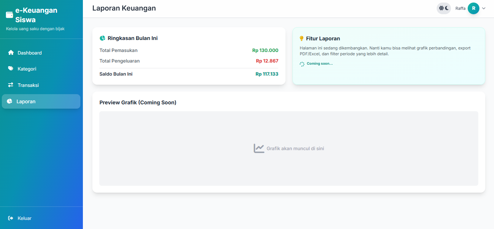

# 💰 e-Keuangan Siswa

Aplikasi manajemen keuangan pribadi untuk siswa yang membantu mencatat pemasukan, pengeluaran, saldo, serta memantau aktivitas keuangan harian dengan antarmuka yang sederhana dan mudah digunakan.



---

## 📖 Tentang Project

e-Keuangan Siswa adalah aplikasi berbasis web yang dibuat menggunakan Laravel dan PostgreSQL untuk membantu siswa mengelola uang saku secara lebih disiplin.

Pengguna dapat:

- Mencatat pemasukan
- Mencatat pengeluaran
- Mengelola kategori transaksi
- Melihat saldo terkini
- Melihat riwayat transaksi
- Melihat ringkasan laporan keuangan
- Mengakses dashboard statistik sederhana

Project ini dibuat sebagai latihan implementasi CRUD, relasi database, autentikasi pengguna, dan pembuatan dashboard menggunakan Laravel.

---

## ✨ Fitur Utama

### 🔐 Authentication

- Login
- Register
- Logout

### 📊 Dashboard

- Total pemasukan
- Total pengeluaran
- Saldo saat ini
- Ringkasan bulan berjalan
- Grafik pemasukan & pengeluaran
- Aktivitas transaksi terbaru

### 📂 Kategori

- Tambah kategori
- Edit kategori
- Hapus kategori

### 💸 Transaksi

- Tambah transaksi
- Edit transaksi
- Hapus transaksi
- Filter transaksi berdasarkan bulan dan tahun

### 📑 Laporan

- Ringkasan keuangan bulanan
- Total pemasukan
- Total pengeluaran
- Saldo bulan berjalan

---

## 🛠️ Tech Stack

### Backend

- Laravel 11
- PHP 8+

### Frontend

- Blade Template
- Tailwind CSS
- Vite

### Database

- PostgreSQL

### Development Tools

- Composer
- NPM
- Git
- GitHub

---

## 📷 Preview

### Landing Page


### Login



### Register



### Dashboard Light Mode



### Dashboard Dark Mode



### Kategori



### Transaksi



### Laporan



---

## 🗄️ Database Structure

Beberapa tabel utama:

### Users

- id
- name
- email
- password

### Categories

- id
- user_id
- nama
- tipe

### Transactions

- id
- user_id
- category_id
- tanggal
- deskripsi
- jumlah

---

## 🚀 Instalasi

Clone repository

```bash
git clone https://github.com/username/e-keuangan-siswa.git
```

Masuk folder project

```bash
cd keuangan-siswa
```

Install dependency

```bash
composer install
```

```bash
npm install
```

Copy environment

```bash
cp .env.example .env
```

Generate key

```bash
php artisan key:generate
```

Konfigurasi PostgreSQL pada file `.env`

```env
DB_CONNECTION=pgsql
DB_HOST=127.0.0.1
DB_PORT=5432
DB_DATABASE=keuangan_siswa
DB_USERNAME=postgres
DB_PASSWORD=password
```

Migrasi database

```bash
php artisan migrate
```

Jalankan Vite

```bash
npm run dev
```

Jalankan server

```bash
php artisan serve
```

---

## 🎯 Tujuan Pembelajaran

Project ini dibuat untuk mempelajari:

- CRUD Laravel
- Authentication
- Relasi Database
- PostgreSQL
- Dashboard Development
- Tailwind CSS
- Manajemen Keuangan Sederhana

---

## 📌 Status Project

✅ Completed

Project ini merupakan salah satu project pembelajaran yang digunakan untuk meningkatkan kemampuan Fullstack Web Development menggunakan Laravel dan PostgreSQL.

---

## 👨‍💻 Developer

**M Raffa Izzel H**

- GitHub: https://github.com/Raffahmii
- LinkedIn: https://www.linkedin.com/in/m-raffa-izzel-h

---
